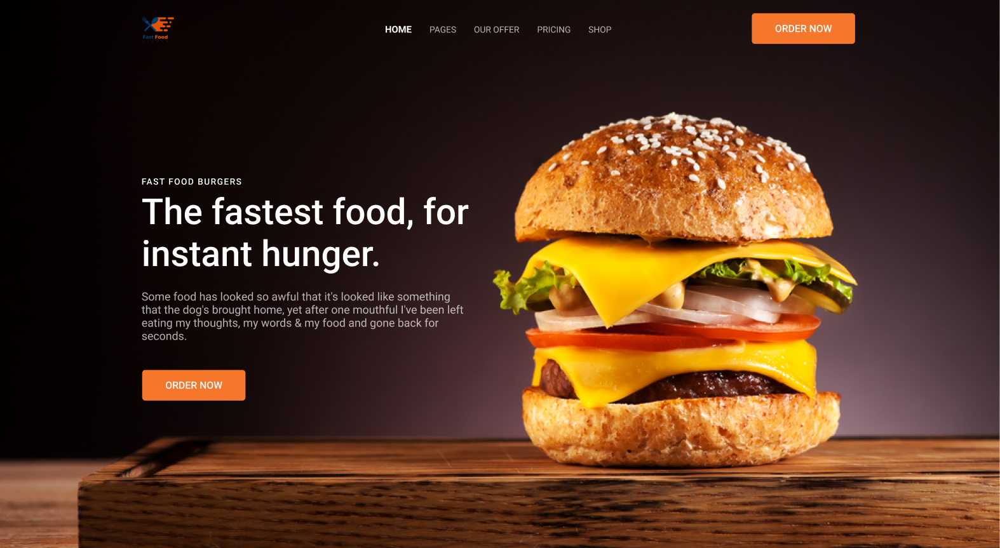
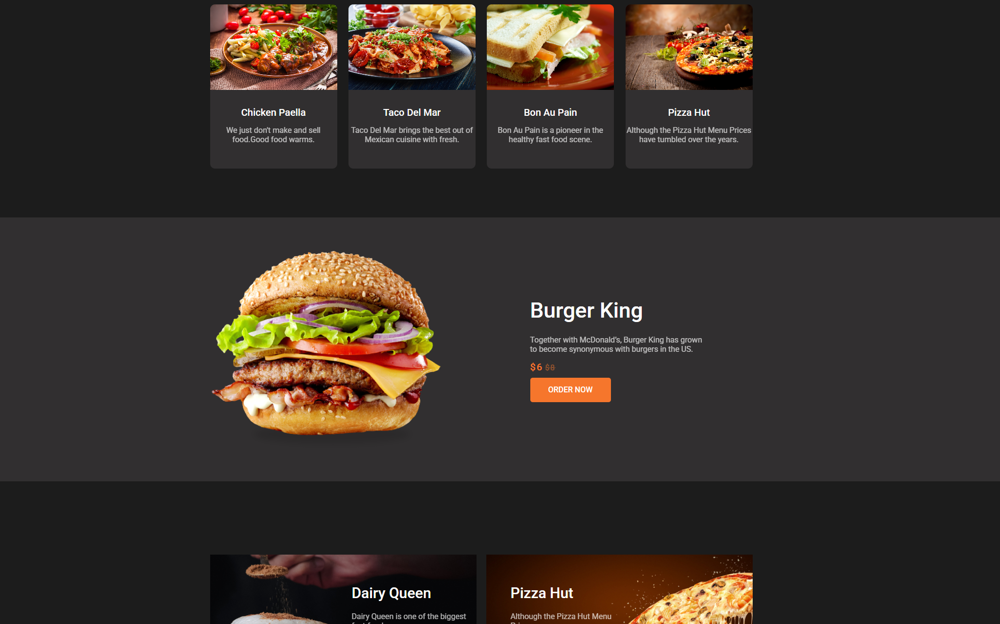
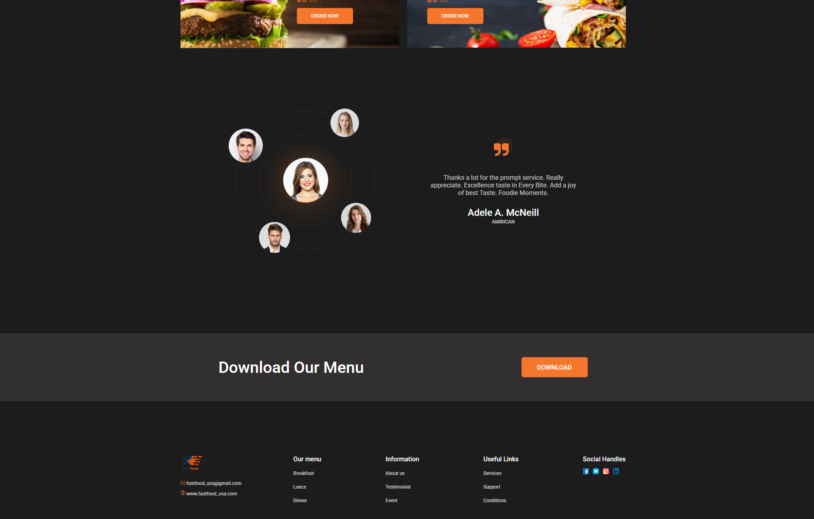

# 🍔 Burger Landing

Адаптивный лендинг сайта фастфуда, разработанный на чистом HTML и CSS.

# Burger Landing

## 📌 О проекте
Одностраничный сайт ресторана с секциями:
- Header (навигация + кнопка заказа)
- Hero / Welcome секция
- Карточки блюд
- Промо-блок продуктов
- Отзывы клиентов
- Скачать меню
- Footer

## ⚙️ Технологии
- HTML5
- CSS3
- Flexbox
- Google Fonts (Roboto)

## 📱 Адаптивность
- Desktop
- Tablet
- Mobile (до 768px и 480px)
- 
## ✨ Функционал
- Навигация
- Hero блок
- Карточки блюд
- Продукты с ценами
- Отзывы
- CTA кнопки
- Адаптив

## 👨‍💻 Автор
Учебный проект (HTML + CSS)

## 📌 Статус
Готовый адаптивный лендинг
